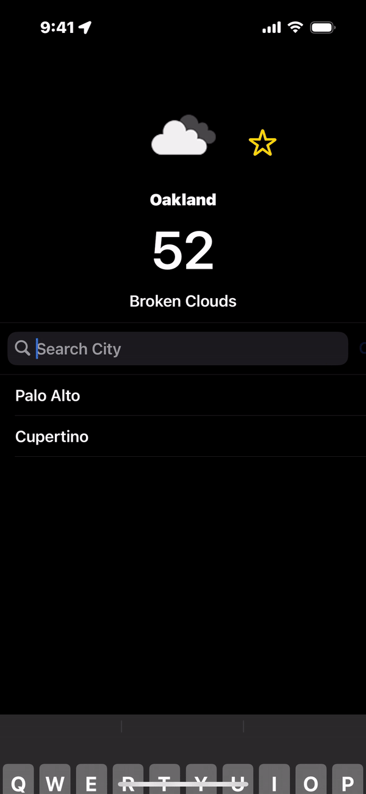

# JPMC_Weather
JPMorgan Coding Challenge
Requirements
These requirements are rather high-level and vague. If there are details I have omitted, it is because I will be happy with any of a wide variety of solutions. Don't worry about finding "the" solution.
Create a browser or native-app-based application to serve as a basic weather app.
Search Screen
Allow customers to enter a US city
Call the openweathermap.org API and display the information you think a user would be interested in seeing. Be sure to has the app download and display a weather icon.
Have image cache if needed
Auto-load the last city searched upon app launch.
Ask the User for location access, If the User gives permission to access the location, then retrieve weather data by default
In order to prevent you from running down rabbit holes that are less important to us, try to prioritize the following:
What is Important
Proper function – requirements met.
Well-constructed, easy-to-follow, commented code (especially comment hacks or workarounds made in the interest of expediency (i.e. // given more time I would prefer to wrap this in a blah blah blah pattern blah blah )).
Proper separation of concerns and best-practice coding patterns.
Defensive code that graciously handles unexpected edge cases.
What is Less Important
UI design – generally, design is handled by a dedicated team in our group.
Demonstrating technologies or techniques you are not already familiar with (for example, if you aren't comfortable building a single-page app, please don't feel you need to learn how for this).

